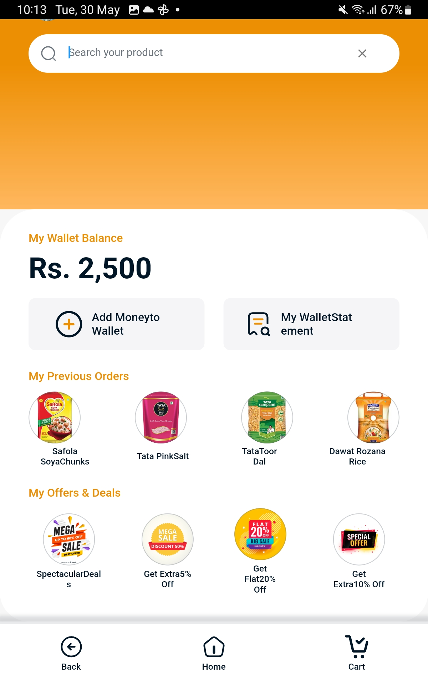

# a2sinternship-project
Internship
# a2sinternshipp
 
Application structure 
 
├── android - It contains files required to run the application on an Android platform. 
├── assets - It contains all images and fonts of my application. 
├── ios - It contains files required to run the application on an iOS platform. 
├── lib - Most important folder in the application, used to write most of the Dart code. 
├── main.dart - Starting point of my application 
├── core 
│ ├── app_export.dart - It contains commonly used file imports 
│ ├── constants - It contains static constant class file 
│ └── utils - It contains common files and utilities of the application 
├── presentation - It contains widgets of the screens 
├── routes - It contains all the routes of the application 
└── theme - It contains app theme and decoration classes 
└── widgets - It contains all custom widget classes 
 
Bloc Architecture 
This app follows the Bloc (Business Logic Component) architecture pattern for managing state and data flow. The Bloc pattern helps in separating  business logic from the UI layer, making the code more modular, testable, and maintainable. 
 
Within the presentation folder, each screen or component has its own directory, which includes the UI code and a corresponding Bloc class.  This separation allows for clear separation of concerns and easier testing of the individual components 
 
The final output screens developed are as follows: 

<table>
<tr>
<td >Screen1</td>
<td >Details</td>
<td >Frame3</td>
</tr>
  </table>
 
A new Flutter project. 
 
## Getting Started 
 
This project is a starting point for a Flutter application. 
 
A few resources to get you started if this is your first Flutter project: 
 
-   [Lab: Write your first Flutter app](https://docs.flutter.dev/get-started/codelab) 
-   [Cookbook: Useful Flutter samples](https://docs.flutter.dev/cookbook) 
 
For help getting started with Flutter development, view the 
[online documentation](https://docs.flutter.dev/), which offers tutorials, 
samples, guidance on mobile development, and a full API reference. 
